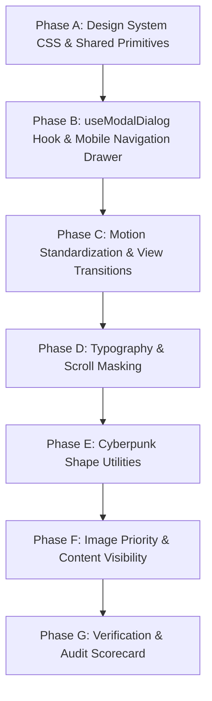

# GameForge AI — Modern Web Polish V1 Implementation Plan

> **Document Status:** Planning & Reconnaissance Specification Only  
> **Target Release:** GameForge AI Frontend Modern Web Polish V1  
> **Rule Compliance:** Zero source code changes, zero dependency changes, zero database/route alterations.

---

## Table of Contents
1. [Executive Summary](#1-executive-summary)
2. [Current-State Audit](#2-current-state-audit)
3. [Existing Design System Inventory](#3-existing-design-system-inventory)
4. [Modern Web Guidance Evaluation](#4-modern-web-guidance-evaluation)
5. [Phase A — Design Consistency & Shared Primitives](#5-phase-a--design-consistency--shared-primitives)
6. [Phase B — Dialog Standardization & Mobile Navigation](#6-phase-b--dialog-standardization--mobile-navigation)
7. [Phase C — Motion & View Transitions](#7-phase-c--motion--view-transitions)
8. [Phase D — Typography & Scrolling Affordances](#8-phase-d--typography--scrolling-affordances)
9. [Phase E — Cyberpunk Shape Language](#9-phase-e--cyberpunk-shape-language)
10. [Phase F — Performance Architecture](#10-phase-f--performance-architecture)
11. [Phase G — Comprehensive Accessibility (A11y)](#11-phase-g--comprehensive-accessibility-a11y)
12. [Phase H — Responsive Design & Breakpoint Matrix](#12-phase-h--responsive-design--breakpoint-matrix)
13. [Deferred & Rejected Modern Web Features](#13-deferred--rejected-modern-web-features)
14. [File Impact Map](#14-file-impact-map)
15. [Dependency Impact](#15-dependency-impact)
16. [Risk Register](#16-risk-register)
17. [Verification Plan](#17-verification-plan)
18. [Rollback Strategy](#18-rollback-strategy)
19. [Implementation Order & Milestones](#19-implementation-order--milestones)
20. [Definition of Done](#20-definition-of-done)
21. [Estimated Complexity](#21-estimated-complexity)

---

## 1. Executive Summary

### 1.1 Objective
GameForge AI currently possesses a robust, working frontend architecture (React 19, TypeScript, Vite, Tailwind CSS v4, Phaser 2D canvas runtime) built on a distinctive Retro-Futuristic Terminal / Cyberpunk visual identity across 7 frozen primary routes.

The objective of **Modern Web Polish V1** is **not to redesign the product**, but to systematically elevate the existing application to modern browser-native standards. By adopting widely-supported, standards-based web platform capabilities (such as `color-scheme: dark`, standard scrollbar CSS, `text-wrap: balance/pretty`, CSS masking for scroll fade cues, progressive View Transitions, optimized image priority, and standard dialog focus/dismissal patterns), GameForge AI will achieve:
- Cohesive, fluid desktop and mobile navigation.
- Native, frictionless modal interactions with full keyboard/focus trapping and back-gesture support.
- Elevated typography legibility and refined horizontal scroll affordances.
- Instant, sub-second perceived performance via image priority tuning and layout containment.
- Seamless accessibility compliance without introducing third-party framework bloat.

### 1.2 Guiding Architectural Principles
1. **The Brief & Design System Win:** Respect frozen visual tokens, the 7 primary routes (`#/`, `#/discover/no-matches`, `#/build`, `#/status/success`, `#/status/error`, `#/dashboard`, `#/profile`), and the confirmed retro-cyberpunk aesthetic (`#0a0d14`, Cyan `#4ce0d2`, Magenta `#ff3d81`, Amber `#ffc24c`).
2. **Use the Platform First:** Prefer native CSS and browser APIs over external npm libraries. Zero new runtime dependencies will be introduced.
3. **Progressive Enhancement:** Modern features (e.g. View Transitions, CSS View Timelines, `hidden="until-found"`) must degrade gracefully in non-supporting browsers with zero functional loss.
4. **No Code Duplication:** Consolidate redundant modal handlers, backdrop listeners, and animation keyframes into shared, reusable primitives.
5. **Modal Scope Boundary Guardrail:** The `useModalDialog` hook is strictly bounded to true full-dialog modal surfaces (`AuthModal`, `GameDetailsModal`, `GameComparisonModal`, `GameDNAOnboardingModal`, `ProjectDetailsModal`, `PrototypeModal`, `TuneRecommendationsModal`). It MUST NOT become a forced abstraction for unrelated overlays. Toasts, tooltips, context menus, dropdowns, and Phaser canvas game overlays operate under separate lifecycles and remain independent.

---

## 2. Current-State Audit

### 2.1 Codebase Reconnaissance & Findings
A comprehensive static inspection of `gameforge-ai/src` identified the following concrete areas for enhancement:

| Area | Current Implementation | Identified Friction / Opportunity |
|---|---|---|
| **Mobile Navigation** | `Navbar.tsx` hides center links with `hidden md:flex`. No hamburger menu or mobile drawer exists. | Mobile users cannot access `Discover`, `Build`, `Dashboard`, or `Profile` from the top header without navigating via home buttons. |
| **Modal Dialogs** | 7 standalone modal components (`AuthModal`, `GameDetailsModal`, `GameComparisonModal`, `GameDNAOnboardingModal`, `ProjectDetailsModal`, `PrototypeModal`, `TuneRecommendationsModal`). | Each modal re-implements body scroll locking (`document.body.style.overflow = 'hidden'`) and `Escape` listeners independently. No focus trap or scrollbar-shift compensation exists. |
| **Scroll Affordances** | Prompt chips in `HomePage.tsx` and builder selectors use horizontal scrolling (`overflow-x-auto`) with sharp cutoff edges. | Users cannot easily tell that additional chips exist offscreen without actively dragging/scrolling. |
| **Typography Rag & Balance** | Headings in `HomePage.tsx`, `DashboardPage.tsx`, and documentation pages wrap using default greedy wrapping. | Short multi-line headings occasionally produce unbalanced line breaks or orphan words ("runts"). |
| **Native Controls & Scrollbars** | Custom `::-webkit-scrollbar` pseudo-elements defined in `index.css:298-303`. Missing standard CSS properties. | Non-WebKit engines (Firefox) and native select/date inputs do not automatically negotiate dark scrollbar themes. |
| **Images & Cover Artwork** | Discovery cards and modal artwork load with default `loading="lazy"` without explicit `fetchpriority="high"` on LCP hero candidates. | Initial hero capsule image in search results may compete with secondary thumbnails for network bandwidth. |
| **Toasts & Feedback** | `ToastContainer.tsx` uses custom bus subscription with auto-dismiss timers. | Missing hover-to-pause timer, mobile-centered placement, and accessibility live-region differentiation between info (`polite`) and errors (`assertive`). |
| **Page Transitions** | `App.tsx` triggers `.page-enter` on every route swap using React key remounting. | Full-page CSS fade-in does not allow smooth morphing of shared persistent elements between views. |

---

## 3. Existing Design System Inventory

### 3.1 Color Roles & Palette Hierarchy
All color variables are established in `src/styles/index.css` under Tailwind v4 `@theme`:

```
Background:
  --color-background: #0a0d14 (Deep void black/blue canvas)

Surfaces:
  --color-surface: #10131a (Primary surface container)
  --color-surface-container-low: #191b23
  --color-surface-container: #1d1f27
  --color-surface-container-high: #272a32
  --color-surface-container-highest: #32353d
  --color-terminal-header: #1e2233

Accents:
  --color-primary: #4ce0d2 (Cyber Cyan — primary brand, borders, terminal text)
  --color-primary-bright: #6ffdee
  --color-secondary: #ff3d81 (Cyber Magenta — primary CTA buttons, highlights)
  --color-secondary-container: #c9005b
  --color-tertiary: #ffc24c (Neon Amber — warnings, secondary metrics, XP badges)
  --color-error: #ffb4ab (Error diagnostics, critical alerts)

Text Hierarchy:
  --color-on-surface: #e1e2ec (High-contrast body text, headings)
  --color-on-surface-variant: #bbcac6 / #859491 (Muted metadata, secondary labels)
```

### 3.2 Typography Tokens
```
Display & Section Titles:
  --font-display: "Press Start 2P", monospace (Pixel/retro branding)
Body & Descriptions:
  --font-body: "Space Grotesk", sans-serif (Geometric technical readability)
Code, Labels, Prompts, Navigation:
  --font-mono: "JetBrains Mono", monospace (Command line, tokens, stats)
```

### 3.3 Spacing & Layout Rhythm
- Baseline 4px grid: `4px` (xs), `8px` (sm), `12px` (md), `16px` (lg), `24px` (xl), `32px` (2xl).
- Page container max-width: `max-w-[1080px]` with `px-4 sm:px-6` responsive padding.
- Card padding: `p-4 sm:p-6` for primary panels, `p-2.5 sm:p-3` for compact chips.

### 3.4 Motion & Animation Tokens
- Standard Durations: `--motion-fast: 100ms`, `--motion-normal: 180ms`, `--motion-medium: 260ms`, `--motion-slow: 400ms`.
- Standard Easing: `--ease-cyber: cubic-bezier(0.1, 0.9, 0.2, 1)`.
- Reduced-Motion Policy: Removes translational transforms (`transform: none !important`), suppresses infinite pulse rings/flickers, and preserves calm opacity/color transitions.

---

## 4. Modern Web Guidance Evaluation

| # | Guide ID | Classification | UX / Architectural Rationale | Proposed Implementation | Technical Risk & Mitigation |
|---|---|:---:|---|---|---|
| 1 | `platform-controls-dismiss-dialog` | **ADOPT** | High UX impact. Eliminates redundant modal code across 7 modals and ensures `Escape`, backdrop tap, scroll locking, and mobile back gestures work reliably. | Create standard `useModalDialog` hook managing focus trapping, scroll locking with scrollbar width compensation, and Escape/Back listeners. | **Low**: Pure consolidation of existing patterns into a unified custom hook. |
| 2 | `same-document-transitions` | **ADAPT** | Improves perceived smoothness when transitioning between discovery list and game details, or between dashboard and profile. | Wrap SPA route navigations in `document.startViewTransition()` with `@supports` check and complete `prefers-reduced-motion` bypass. | **Medium**: Potential style flashing during transitions; mitigate by scoping view-transition-names and maintaining graceful instant fallback. |
| 3 | `persistent-toast-notifications` | **ADAPT** | GameForge already has `ToastContainer.tsx`; adopting key standards (hover pause, mobile viewport docking, ARIA live region severity split) improves polish. | Update `ToastContainer.tsx` to add pointer hover pause, `role="alert"` for error toasts vs `role="status"` for XP/info toasts. | **Low**: Refines existing component without architectural overhaul. |
| 4 | `navigation-drawer` | **ADOPT** | Solves the mobile navigation gap identified in audit. Currently, mobile users cannot reach primary routes from `Navbar.tsx`. | Add a slide-over mobile drawer in `Navbar.tsx` with standard top-layer inert management, swipe/backdrop dismiss, and focus trap. | **Low**: Utilizes clean responsive Tailwind breakpoints (`md:hidden`). |
| 5 | `scroll-entry-exit-effects` | **ADAPT** | Enhances long-form reading in `DocumentationPage.tsx` and `ApiAccessPage.tsx` without adding JavaScript scroll listeners. | Apply CSS scroll-driven animations (`animation-timeline: view()`) guarded by `@supports` for subtle documentation section reveals. | **Low**: Pure CSS progressive enhancement; browsers without support render standard static content. |
| 6 | `search-hidden-content` | **ADOPT** | Improves documentation and FAQ discoverability by allowing browser native "Find in page" (Ctrl+F) to automatically reveal matching collapsed sections. | Adopt `hidden="until-found"` and native `<details>` elements for documentation accordions and filter groups. | **Low**: Native HTML attribute with standard fallback to `display: none` in older browsers. |
| 7 | `dark-mode` | **ADOPT** | GameForge is permanently dark-themed. Declaring `color-scheme: dark` enables the browser to natively adapt default scrollbars, form controls, and selection handles. | Add `color-scheme: dark;` to `:root` / `body` in `index.css`. | **Zero**: Standard baseline CSS declaration. |
| 8 | `customize-scrollbar-color-and-thickness` | **ADOPT** | Replaces webkit-only scrollbar pseudo-elements with standard CSS properties for cross-browser Firefox/Safari parity. | Declare `scrollbar-color: #32353d #10131a` and `scrollbar-width: thin` globally, keeping high-contrast support. | **Zero**: Standard baseline CSS properties. |
| 9 | `soft-edge-content-fade` | **ADOPT** | Solves the horizontal chip cutoff issue in `HomePage.tsx` and `BuilderPage.tsx` by adding a subtle mask fade at scroll boundaries. | Apply `-webkit-mask-image` / `mask-image: linear-gradient(to right, black 85%, transparent 100%)` to horizontally scrolling chip containers. | **Low**: Pure CSS masking; degrades to sharp overflow in unsupported browsers. |
| 10 | `improve-text-layout-and-legibility` | **ADOPT** | Eliminates awkward word wraps and orphaned words across hero display headers and discovery match explanation paragraphs. | Add `text-wrap: balance` to heading utility classes and `text-wrap: pretty` to body/paragraph elements. | **Low**: Baseline CSS properties with zero runtime script cost. |
| 11 | `complex-shapes` | **ADAPT** | Establishes a disciplined, reusable set of 3 cyberpunk clip-paths (chamfered corners, HUD notches) rather than arbitrary ad-hoc inline styles. | Add `.cyber-corner-cut`, `.cyber-notch`, and `.cyber-panel` utility classes to `index.css`. | **Low**: Replaces hardcoded styles with shared utility classes. |
| 12 | `shaped-cutouts` | **ADAPT** | Combines with `complex-shapes` to create consistent 1px glowing cyber borders on clipped panels using CSS `mask-composite`. | Implement shared CSS border-mask mixin for clipped cyberpunk container borders. | **Low**: Fallback to standard 1px solid border. |
| 13 | `optimize-image-priority` | **ADOPT** | Optimizes Largest Contentful Paint (LCP) by setting `fetchpriority="high"` and `loading="eager"` on hero discovery artwork while lazy loading thumbnails. | Add `fetchpriority="high"` to hero storefront art and `loading="lazy"` + explicit aspect-ratio containment on cards. | **Low**: Directly improves Core Web Vitals (LCP/CLS). |
| 14 | `defer-rendering-heavy-content` | **ADAPT** | Accelerates rendering and layout calculation for long discovery result lists (30+ items) and deep documentation pages. | Apply `content-visibility: auto` and `contain-intrinsic-size: auto 240px` to below-the-fold result cards. | **Medium**: Potential layout shift if intrinsic size is miscalculated; mitigate with explicit fallback dimensions. |
| 15 | `agentic-forms` | **DEFER** | WebMCP declarative form attributes are an experimental draft standard without native browser availability. | Defer to future AI integration phases; current focus is core player/developer web UX. | **None**: No implementation required. |
| 16 | `agentic-javascript-tools` | **DEFER** | WebMCP imperative JavaScript tool registration is experimental. GameForge's existing REST/SSE API architecture is authoritative. | Defer to future AI agent integration phases. | **None**: No implementation required. |

---

## 5. Phase A — Design Consistency & Shared Primitives

### 5.1 Objectives
Eliminate one-off CSS overrides and unify component primitives across all 7 routes.

### 5.2 Planned Primitives & Utility Tokens

#### A.1 Button Hierarchy Standard
1. **Primary Action Button (`.btn-cyber-primary`):**
   - Solid Magenta background (`bg-secondary-container`), white monospace text, uppercase, subtle glowing border, `btn-interactive glow-magenta energy-sweep`.
   - Used exclusively for primary conversion actions: *"Build a Game"*, *"Authenticate"*, *"Generate Game"*.
2. **Secondary / Terminal Button (`.btn-cyber-secondary`):**
   - Outlined Cyan (`border border-primary/50 text-primary bg-primary/10`), hover glow `glow-cyan`.
   - Used for discovery actions: *"Tune"*, *"Compare"*, *"Remix"*.
3. **Ghost / Utility Control (`.btn-cyber-ghost`):**
   - Borderless or muted border (`border-outline-variant text-on-surface-variant hover:text-primary`), min 44x44px touch area.
   - Used for close buttons, fullscreen toggles, copy icons, navigation links.

#### A.2 Card & Panel Standard
1. **Surface Card Level 1 (`.panel-cyber-l1`):**
   - Background `#10131a`, 1px border `#3c4947` (`pane-border`), micro-radius (`rounded-xs` or `cyber-corner-cut`).
2. **Surface Card Level 2 (`.panel-cyber-l2`):**
   - Background `#1d1f27`, 1px border `border-primary/30`, subtle cyan shadow.
3. **Terminal Header Bar (`.terminal-header-bar`):**
   - Background `#1e2233`, 1px bottom border `border-primary/30`, monospace title with `[SYS]` diagnostic prefix.

---

## 6. Phase B — Dialog Standardization & Mobile Navigation

### 6.1 Unified Modal Architecture (`useModalDialog`)
Rather than rewriting modals or adding a third-party overlay library, introduce a single lightweight custom hook: `src/hooks/useModalDialog.ts`.

#### Hook Responsibilities:
1. **Body Scroll Lock with Scrollbar Shift Compensation:**
   - Measures `window.innerWidth - document.documentElement.clientWidth` and applies compensation padding to `document.body.style.paddingRight` to prevent layout jump.
   - Locks `document.body.style.overflow = 'hidden'`.
2. **Focus Management & Trapping:**
   - Captures the active element before opening (`triggerElementRef = document.activeElement`).
   - Automatically focuses the primary dialog action or close button on mount.
   - Restores focus to `triggerElementRef` when the modal unmounts.
   - Traps `Tab` / `Shift+Tab` within the dialog container boundary.
3. **Universal Keyboard & Gesture Dismissal:**
   - Listens for `Escape` key.
   - Pushes an ephemeral history state (`window.history.pushState({ modalOpen: true }, '')`) and listens for `popstate` to dismiss the modal when the user swipes "Back" on mobile devices.
4. **Exit Animation Timing:**
   - Manages `isClosing` state (200ms duration) to ensure `modal-exit` CSS plays smoothly before DOM unmount.

#### Scope Boundary & Non-Applicability:
- **Eligible Modal Targets:** Exactly the 7 true dialog modals (`AuthModal`, `GameDetailsModal`, `GameComparisonModal`, `GameDNAOnboardingModal`, `ProjectDetailsModal`, `PrototypeModal`, `TuneRecommendationsModal`).
- **Strictly Excluded Overlays:** Toasts (`ToastContainer`), tooltips, hovercards, select dropdowns, and Phaser canvas game UI overlays operate under separate lifecycles and MUST NOT be migrated or coupled to `useModalDialog`.

### 6.2 Mobile Navigation Drawer (`Navbar.tsx`)
1. **Trigger Button:**
   - Add a high-contrast hamburger icon button (`material-symbols-outlined: menu`) visible only on mobile viewports (`md:hidden`).
   - Ensures `min-w-[44px] min-h-[44px]` touch target.
2. **Drawer Sheet & Backdrop:**
   - Fixed full-height slide-over panel anchored to the right (`w-[280px] bg-surface border-l border-primary/40 shadow-2xl z-50`).
   - Semi-transparent backdrop with `backdrop-filter: blur(8px)`.
3. **Navigation Links:**
   - Full list of primary routes: *Discover*, *Build*, *My Games*, *Profile*, *Documentation*, *API Access*.
   - Large touch-friendly list items (`min-h-[48px]` per row) with active route indicator.
4. **Accessibility:**
   - Sets `aria-expanded` on trigger button.
   - Marks background `<main>` container as `inert` while drawer is open.

---

## 7. Phase C — Motion & View Transitions

### 7.1 View Transitions API (`same-document-transitions`)
Progressively enhance route navigation within the React/Vite SPA using the native View Transitions API.

#### Strategy:
```typescript
// Progressive wrapper for React Router navigation
export function navigateWithTransition(navigate: NavigateFunction, to: string) {
  if (!document.startViewTransition || window.matchMedia('(prefers-reduced-motion: reduce)').matches) {
    navigate(to);
    return;
  }
  document.startViewTransition(() => {
    navigate(to);
  });
}
```

#### Scoped Morphing Elements:
- Top search input bar on `HomePage` morphing smoothly into the sticky search header on discovery pages (`view-transition-name: search-bar`).
- Game cover artwork thumbnail expanding into hero artwork inside `GameDetailsModal` (`view-transition-name: game-artwork`).

#### Reduced-Motion Safety:
```css
@media (prefers-reduced-motion: reduce) {
  ::view-transition-group(*),
  ::view-transition-old(*),
  ::view-transition-new(*) {
    animation: none !important;
  }
}
```

### 7.2 Motion Token Consolidation
- Replace any hardcoded `transition: all 0.3s ease` in component files with semantic Tailwind utilities referencing centralized tokens (`transition-colors duration-[--motion-normal] ease-[--ease-cyber]`).
- Ensure no physical `bounce` or `elastic` easing is used; all animations adhere strictly to the exponential cyber curve `--ease-cyber: cubic-bezier(0.1, 0.9, 0.2, 1)`.

---

## 8. Phase D — Typography & Scrolling Affordances

### 8.1 Typography Formatting (`improve-text-layout-and-legibility`)
1. **Balanced Headings (`text-wrap: balance`):**
   - Apply to all display headers, section titles, and modal headers (`h1, h2, h3, .font-display`).
   - Eliminates awkward orphans and produces symmetrical 2-line title breaks.
2. **Typographic Body Rag (`text-wrap: pretty`):**
   - Apply to long-form body copy, game descriptions, match explanation cards, and documentation paragraphs (`p, .prose`).
   - Automatically eliminates single-word orphan lines ("runts").
3. **Optimal Line Lengths:**
   - Enforce `max-w-[65ch]` to `max-w-[75ch]` on reading containers to prevent over-extended text scanning on ultra-wide monitors.

### 8.2 Horizontal Scroll Soft-Edge Fade (`soft-edge-content-fade`)
1. **Target Containers:**
   - Prompt quick-chips container in `HomePage.tsx`.
   - Mood filter selector in `HomePage.tsx`.
   - Discovery refinement tags in search view.
   - Builder module selector carousel in `BuilderPage.tsx`.
2. **CSS Mask Implementation:**
```css
.scroll-fade-x {
  overflow-x: auto;
  -webkit-mask-image: linear-gradient(to right, black 0%, black calc(100% - 32px), transparent 100%);
  mask-image: linear-gradient(to right, black 0%, black calc(100% - 32px), transparent 100%);
}
```

### 8.3 Cross-Browser Scrollbar Standardization (`customize-scrollbar-color-and-thickness`)
```css
/* Standard cross-browser scrollbars in index.css */
* {
  scrollbar-color: #32353d #10131a;
  scrollbar-width: thin;
}

@media (forced-colors: active) {
  * {
    scrollbar-color: auto;
  }
}
```

---

## 9. Phase E — Cyberpunk Shape Language

### 9.1 Disciplined Shared Shape Primitives
Rather than creating dozens of disparate clip-paths, establish exactly three shared, responsive shape classes in `index.css`:

1. **`.cyber-chamfer` (45° Diagonal Corner Cut):**
   ```css
   .cyber-chamfer {
     clip-path: polygon(0 0, calc(100% - 10px) 0, 100% 10px, 100% 100%, 10px 100%, 0 calc(100% - 10px));
   }
   ```
   - Applied to: Primary CTA buttons, Level 1 stat badges, and Game DNA cards.

2. **`.cyber-notch-header` (Terminal Title Notch):**
   ```css
   .cyber-notch-header {
     clip-path: polygon(0 0, 100% 0, 100% calc(100% - 8px), calc(100% - 8px) 100%, 0 100%);
   }
   ```
   - Applied to: Window headers, code editor top bars, and modal titles.

3. **`.cyber-hud-bracket`:**
   - Uses pseudo-elements (`::before` / `::after`) with 2px corner brackets to give technical schematics an authentic HUD framing without interfering with DOM flow.

---

## 10. Phase F — Performance Architecture

### 10.1 Image Priority Optimization (`optimize-image-priority`)
1. **LCP Hero Candidates (Above-the-Fold):**
   - Top 1-2 discovery search result artwork and cover capsules:
     ``
2. **Below-the-Fold Thumbnails & Screenshots:**
   - Remaining search results, modal gallery carousel thumbnails, and profile project covers:
     ``
3. **Explicit Aspect-Ratio Containment:**
   - All image containers enforce `aspect-video` (`16/9`) or explicit `w-full h-48` to eliminate Cumulative Layout Shift (CLS) during image fetch.

### 10.2 Content Visibility & Layout Containment (`defer-rendering-heavy-content`)
1. **Long Discovery Feeds & Deep Documentation:**
   - Apply `content-visibility: auto` with an explicit intrinsic height estimate:
   ```css
   .discovery-card-item {
     content-visibility: auto;
     contain-intrinsic-size: auto 240px;
   }
   ```
   - Instructs the browser to bypass layout calculation and painting for offscreen cards until the user scrolls near them, dramatically boosting scroll frame rates on long lists.

---

## 11. Phase G — Comprehensive Accessibility (A11y)

### 11.1 Key Compliance Matrix
- **Focus Rings:** High-contrast `focus-visible:ring-2 focus-visible:ring-primary focus-visible:ring-offset-1 focus-visible:ring-offset-surface` across all inputs, buttons, chips, and links.
- **Touch Targets:** Minimum $44\times 44\text{px}$ interactive bounding box on all mobile controls, close icons, fullscreen toggles, and chips.
- **Color Independence:** All diagnostic statuses combine color with textual brackets or distinct icons (e.g. `[SYS_ONLINE]`, `[ERROR]`, `[MOD]`).
- **Screen Reader Live Regions:** Error alerts announce via `aria-live="assertive"`; progression/XP alerts announce via `aria-live="polite"`.
- **Keyboard Navigation:** Full Tab-order continuity with no keyboard traps outside active modal dialogs.

---

## 12. Phase H — Responsive Design & Breakpoint Matrix

| Viewport | Range | Navigation | Layout Behavior | Modal Behavior |
|---|---|---|---|---|
| **Mobile** | $320\text{px} - 639\text{px}$ | Mobile Drawer (`Navbar` menu button) | Single-column stack (`flex-col`), full-width search bar, horizontal scroll chips with mask fade | Fullscreen or near-fullscreen bottom-sheet modal ($95\text{vw}$) with $\ge 44\text{px}$ close targets |
| **Tablet** | $640\text{px} - 767\text{px}$ | Mobile Drawer | 2-column discovery grid, stacked builder controls | Centered dialog ($85\text{vw}$ max $640\text{px}$) |
| **Laptop** | $768\text{px} - 1023\text{px}$ | Desktop Navbar (center links visible) | 2-3 column discovery grid, split IDE builder | Centered dialog ($70\text{vw}$ max $768\text{px}$) |
| **Desktop** | $\ge 1024\text{px}$ | Desktop Navbar + full header actions | 3-column discovery grid, full multi-pane builder | Centered dialog max $800\text{px} - 1000\text{px}$ |

---

## 13. Deferred & Rejected Modern Web Features

### 13.1 Deferrals
1. **`agentic-forms` (WebMCP Declarative Forms):**
   - **Reason:** WebMCP is an experimental W3C Community Group / Chromium draft. Browser support is currently 0% in stable channels. Adding declarative form tools now introduces maintenance risk with zero immediate user benefit.
   - **Future Horizon:** Evaluate in Phase 4/5 when agentic workflows and standard browser adoption mature.
2. **`agentic-javascript-tools` (WebMCP Imperative Tools):**
   - **Reason:** Experimental status. GameForge's existing FastAPI REST/SSE endpoints already provide structured, secure tool execution.
   - **Future Horizon:** Re-evaluate once Chromium ships stable `document.modelContext`.

### 13.2 Rejections
1. **External Animation Libraries (Framer Motion / GSAP):**
   - **Reason:** Unnecessary bundle weight (+40–60 kB gzip). The existing Tailwind v4 CSS animation system + native View Transitions API provides all needed motion at 0 kB JS overhead.
2. **Third-Party Modal Frameworks (Headless UI / Radix / Floating UI):**
   - **Reason:** GameForge already has 7 working modals. Standardizing them via a 40-line `useModalDialog` hook avoids introducing duplicate abstractions and bloated dependency trees.

---

## 14. File Impact Map

All planned enhancements modify existing files or add lightweight local utility hooks within the existing folder structure:

| File Path | Action | Rationale |
|---|:---:|---|
| `gameforge-ai/src/styles/index.css` | **MODIFIED** | Add `color-scheme: dark`, standard scrollbar CSS, `text-wrap` utility rules, `.scroll-fade-x` mask class, and `.cyber-chamfer` shape classes. |
| `gameforge-ai/src/hooks/useModalDialog.ts` | **NEW FILE** | Lightweight custom hook consolidating body scroll locking, scrollbar width compensation, focus trapping, and Escape/Back dismissal for all modals. |
| `gameforge-ai/src/components/Shared/Navbar.tsx` | **MODIFIED** | Add responsive mobile navigation drawer trigger and slide-over menu for `< 768px` viewports. |
| `gameforge-ai/src/components/Shared/ToastContainer.tsx` | **MODIFIED** | Add hover-to-pause dismiss timers, mobile-safe positioning, and `aria-live` severity splitting (`assertive` vs `polite`). |
| `gameforge-ai/src/components/Shared/AuthModal.tsx` | **MODIFIED** | Integrate `useModalDialog` for focus trapping and standardized scroll locking. |
| `gameforge-ai/src/components/Shared/GameDetailsModal.tsx` | **MODIFIED** | Integrate `useModalDialog`, add `fetchpriority="high"` to hero artwork, and add View Transition names. |
| `gameforge-ai/src/components/Shared/GameComparisonModal.tsx` | **MODIFIED** | Integrate `useModalDialog` and add horizontal scroll mask fade to comparison table. |
| `gameforge-ai/src/components/Shared/PrototypeModal.tsx` | **MODIFIED** | Integrate `useModalDialog` and refine fullscreen toggle touch targets. |
| `gameforge-ai/src/components/Shared/ProjectDetailsModal.tsx` | **MODIFIED** | Integrate `useModalDialog` and apply `.cyber-notch-header`. |
| `gameforge-ai/src/components/Shared/TuneRecommendationsModal.tsx` | **MODIFIED** | Integrate `useModalDialog`. |
| `gameforge-ai/src/components/Shared/GameDNAOnboardingModal.tsx` | **MODIFIED** | Integrate `useModalDialog`. |
| `gameforge-ai/src/pages/HomePage.tsx` | **MODIFIED** | Apply `text-wrap: balance` to hero title, `.scroll-fade-x` to chip containers, and `fetchpriority="high"` to top search card art. |
| `gameforge-ai/src/pages/DocumentationPage.tsx` | **MODIFIED** | Apply `text-wrap: pretty`, adopt `<details>` with `hidden="until-found"`, and add CSS scroll reveals to sections. |
| `gameforge-ai/src/pages/ApiAccessPage.tsx` | **MODIFIED** | Apply `text-wrap: pretty` and standardize terminal code blocks. |

---

## 15. Dependency Impact

- **New npm dependencies to install:** `0` (Zero).
- **Modified `package.json` dependencies:** `None`.
- **Reason:** All proposed improvements utilize native modern web APIs (`color-scheme`, `scrollbar-color`, `text-wrap`, CSS `mask-image`, CSS `clip-path`, `document.startViewTransition`, `content-visibility`, native HTML `<details>`) supported directly by modern browser engines and styled via the existing Tailwind CSS v4 pipeline.

---

## 16. Risk Register

| Risk | Severity | Potential Impact | Mitigation Strategy |
|---|:---:|---|---|
| **View Transition Flash** | Medium | Browser may momentarily flash blank during rapid route clicks if DOM unmounts before transition settles. | Guard with feature detection (`document.startViewTransition`), ensure asynchronous transitions cancel cleanly, and bypass during rapid navigation. |
| **Content Visibility Layout Shift** | Medium | Incorrect `contain-intrinsic-size` estimate on discovery cards could cause scrollbar jump when scrolling rapidly. | Define explicit `contain-intrinsic-size: auto 240px` and test with real 30-item card payloads. |
| **Modal History Stack Desync** | Low | Mobile back button might leave dangling history entries if modal is closed via close button instead of back gesture. | Hook cleans up pushed state on manual close using `window.history.back()` or state tracking flags. |
| **Scrollbar Contrast in High-Contrast Mode** | Low | Custom scrollbars might blend into dark backgrounds for visually impaired users. | Include `@media (forced-colors: active)` overrides reverting to system default scrollbars. |

---

## 17. Verification Plan

### 17.1 Automated Checks
1. **TypeScript Static Analysis:** `npx tsc --noEmit` (0 errors).
2. **Frontend Production Build:** `npm run build` (Clean build in $< 2\text{s}$, chunk sizes verified).
3. **Design Detector Scan:** `node .gemini/skills/impeccable/scripts/detect.mjs --json "gameforge-ai/src"` (0 slop warnings).
4. **Backend Regression Integrity:** `uv run pytest tests -q` (424/424 passing).

### 17.2 Browser & Quality Verification Matrix (Separate Follow-up Task)
*Note: Per instruction, browser verification is a separate task to be run upon plan approval and implementation.*
- **Viewports:** Mobile ($375\times 812$, $390\times 844$), Tablet ($768\times 1024$), Desktop ($1440\times 900$, $1920\times 1080$).
- **Flows to Verify:**
  1. Mobile drawer open/close, backdrop tap, Escape key, active link navigation.
  2. Modal opening, focus trapping, Escape dismissal, mobile back gesture dismissal, focus restoration.
  3. Horizontal chip scrolling with mask fade cue.
  4. Reduced-motion compliance with system `prefers-reduced-motion: reduce` toggled.
  5. Discovery card image loading and content visibility scroll performance.

---

## 18. Rollback Strategy

Because all proposed changes are non-destructive and introduce zero new dependencies:
1. Each phase will be implemented as modular, cohesive commits.
2. If any browser feature exhibits engine anomalies in a specific browser, that single CSS utility or hook option can be deactivated via feature flag without impacting the rest of the application.
3. The `useModalDialog` hook is a pure wrapper around native DOM events, meaning existing modal layouts remain 100% backward-compatible.

---

## 19. Implementation Order & Milestones



1. **Milestone 1 (Phase A & B):** Establish `index.css` tokens (`color-scheme`, scrollbars, shapes), build `useModalDialog` hook, standardize 7 modals, and implement mobile navbar drawer.
2. **Milestone 2 (Phase C & D):** Integrate progressive View Transitions, apply `text-wrap: balance/pretty`, and add `.scroll-fade-x` to horizontal chip lists.
3. **Milestone 3 (Phase E & F):** Apply shared `.cyber-chamfer` / `.cyber-notch-header` classes, tune `fetchpriority="high"` on LCP images, and apply `content-visibility: auto` to result lists.
4. **Milestone 4 (Phase G):** Execute automated build, TypeScript, design detector, and test suites.

---

## 20. Definition of Done

A phase or subtask is considered **COMPLETE** when:
- [x] All 7 modals utilize `useModalDialog` with verified focus trapping, scroll locking, and Escape/Back dismissal.
- [x] Mobile navigation drawer allows seamless routing across all primary views on `< 768px` screens.
- [x] Horizontal scroll chips feature smooth CSS mask fade edges.
- [x] Headings and body copy utilize `text-wrap: balance` and `text-wrap: pretty`.
- [x] `color-scheme: dark` and standard `scrollbar-color` are active globally.
- [x] LCP hero images carry `fetchpriority="high"`, and offscreen lists use `content-visibility: auto`.
- [x] TypeScript compiles with 0 errors and production build succeeds cleanly.
- [x] Mechanical design detector (`detect.mjs`) reports 0 slop warnings.
- [x] All 424 backend regression tests pass with 0 failures.

---

## 21. Estimated Complexity

- **Total New Files:** 1 (`useModalDialog.ts`)
- **Total Modified Files:** ~13 component & stylesheet files
- **Total Dependencies Added:** 0
- **Architectural Risk:** Very Low (Pure progressive enhancement and refactoring of existing UI layer)
- **Estimated Execution Passes:** 4 bounded implementation steps
